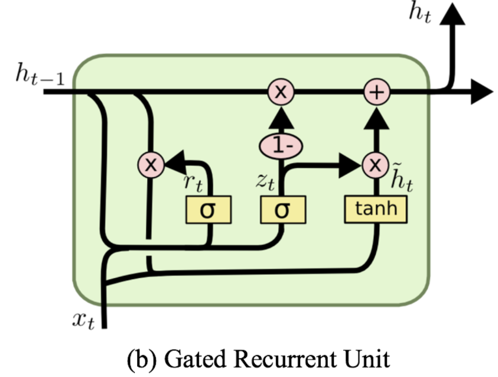

## Forward

 $z_ {t} =\sigma([x_{t}, h_{t-1}]\times W_{z} + b_z)$
 
 $r_ {t} = \sigma ( [x_{t}, h_{t-1}]\times W_{r} + b_r)$

 $\widehat h_t= \tanh ([x_t, r_ {t} * h_ {t-1}]\times W_{h} + b_h)$
 
 $h_ {t} =(1- z_ {t} )* h_ {t-1} + z_ {t} * \widehat h_ {t}$ 

---
## Backprop

$\delta_{z_t} = \delta_{h_t} * (\widehat h_t - h_{t-1}) * \sigma'(z_t)$

$\delta_{\widehat{h_t}} = \delta_{h_t} * z_t * \tanh' (\widehat {h_t})$

$\delta_{r_t} = (\delta_{\widehat h_t} \cdot W_h[:, \text{in}:]^T) * h_{t-1} * \sigma'(r_t)$

 
  $\Delta W_z = [x_t, h_{t-1}]^T \cdot \delta_{z_t}, \quad \Delta b_z = \sum \delta_{z_t}$
  
  $\Delta W_r = [x_t, h_{t-1}]^T \cdot \delta_{r_t}, \quad \Delta b_r = \sum \delta_{r_t}$
  
  $\Delta W_h = [x_t, r_t * h_{t-1}]^T \cdot \delta_{\widehat{h_t}}, \quad \Delta b_h = \sum \delta_{\widehat{h_t}}$

$\delta_{h_{t-1}} = \delta_{h_t} * (1 - z_t) + \delta_{z_t} \cdot W_z[:, \text{in}:]^T + \delta_{r_t} \cdot W_r[:, \text{in}:]^T + (\delta_{\widehat{h}_t} \cdot W_h[:, \text{in}:]^T) * r_t$

$\delta_{x_t} = (\delta_{z_t} \cdot W_z[:, :\text{in}]^T) + (\delta_{r_t} \cdot W_r[:, :\text{in}]^T) + (\delta_{\widehat{h}_t} \cdot W_h[:, :\text{in}]^T)$
