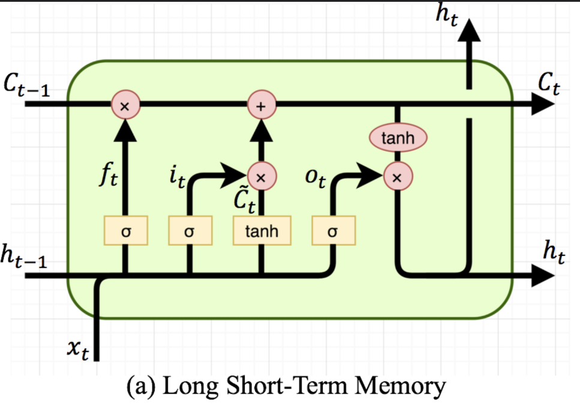

### Forward

$h_{t}=o_{t}*\tanh(C_{t})$

$o_{t}= \sigma([x_{t}, h_{t-1}]\times W_{o} + b_{o})$

$C_{t} = f_{t} * C_{t-1} + i_{t} * \tilde{C_t}$

 $i_ {t} = \sigma ( [x_{t}, h_{t-1}]\times W_{o} + b_ {i} )$
 
 $\tilde{C_ {t}}  =  \tanh ( [x_{t}, h_{t-1}]\times W_{o} + b_ {C})$ 
 
 $f_ {t} = \sigma ( [x_{t}, h_{t-1}]\times W_{o} + b_ {t} )$

	Если все раскрыть, выглядит вот так (не использовал)

$$
h_t=\sigma(W_{o}[h_{t-1}, x_{t}] + b_{o}) * \tanh(
  \sigma ( W_ {f} \cdot [h_ {t-1},x_ {t}] + b_ {t})* C_{t-1} + (
    \sigma ( W_ {i} \cdot [h_ {t-1},x_ {t}] + b_ {i} )*
    \tanh ( W_ {C} \cdot [h_ {t-1},x_ {t}] + b_ {C}))
  )
$$
 
---
### Backprop
Градиент скрытого состояния:

    $h_t = \frac{\partial \text{Loss}}{\partial h_t}​$

- Градиент выходных ворот:

	$\delta o_t = \delta h_t * \tanh(C_t) * \sigma'(o_t)$
- Градиент состояния ячейки:

	$C_t = \delta h_t * o_t * \tanh'(C_t) + \delta C_{t+1} * f_{t+1}​$
- Градиент входных ворота:

	$\delta i_t = \delta C_t * \tilde{C_t} * \sigma'(i_t)$
- Забывающее ворота:

	$\delta f_t = \delta C_t * C_{t-1} * \sigma'(f_t)$
- Кандидат состояния:

	$\delta \tilde{C_t} = \delta C_t * i_t * \tanh'(\tilde{C_t})$

---

#### 2. Передача градиента назад

Чтобы передать градиенты на предыдущие временные шаги:

1. Градиент по $h_{t-1}$​:

	$\delta h_{t-1} = (\delta i_t \cdot W_i + \delta f_t \cdot W_f + \delta o_t \cdot W_o + \delta \tilde{C_t} \cdot W_C)[:in\_len]$
1. Градиент по $x_t$​:

	$\delta x_t = (\delta i_t \cdot W_i + \delta f_t \cdot W_f + \delta o_t \cdot W_o + \delta \tilde{C_t} \cdot W_C)[in\_len:]$

---

### 3. Обновление весов

Для каждого из ворот (входного, забывающего, выходного и кандидата состояния) вычисляются градиенты по параметрам:

  $\Delta W_k = [x_t, h_{t-1}]^T \cdot \delta_{k_t}, \quad \Delta b_k = \sum \delta_{k_t}$
  
  Вместо k подставить i, o, f, c

